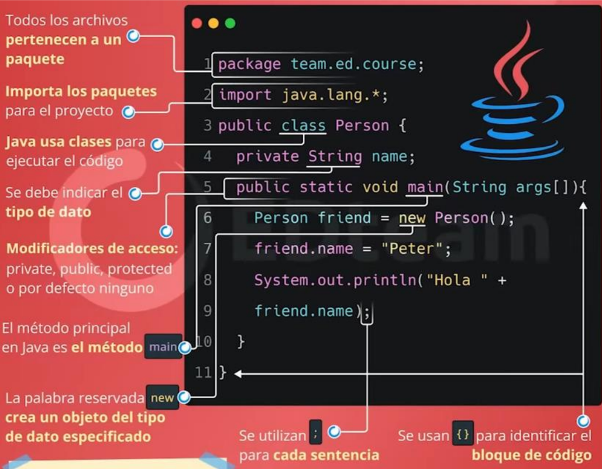

# <p style="text-align: center; margin: 0 auto;"><span style="color: #FF0000;">**ESCUELA  </span> <span style= "color: #000080;" >POLITECNICA </span>  NACIONAL** 
## **Isaac Proaño**
## <span style= "color: #0000FF;" >**PROGRAMACION II**

# <p style="text-align: center; margin: 0 auto;"> **MARKDOWN PRIMER BIMESTRE**


# <span style="color: #FF0000;">Clase #1 --- 07/11/2023 </span>

## <p style="text-align: center; margin: 0 auto;"><span style="color: #00FFFF;">**IDE Visual Studio Code** </span> [](https://code.visualstudio.com/) 

 Visual Studio Code (VS Code) es un editor de código fuente gratuito y de código abierto desarrollado por Microsoft. Es altamente personalizable, ligero y compatible con una variedad de lenguajes de programación, con características como resaltado de sintaxis, depuración integrada y soporte para extensiones.

 ### <span style="color: #00FFFF;"> Funcionamiento </span>
0. Instalar JDK.
1. Instalar git bash.
2. Instalar el VScode.
3. Crear una cuenta de github e integrarla al VScode.
4. Descargar las extensiones para el correcto funcionamiento de VScode (Extension pack for Java)

### Tip:
Probar juegos de mecanografia para mejorar la velocidad, precision y memorizacion a la hora de usar el teclado. 
### <span style="color: #00FFFF;"> Configuracion +_+ </span>
0. Vincular la cuenta de github para que sea sencillo trabajar y guardar los trabajos realizados en la nube.
1. Crear un workdirectory para guardar los archivos de forma local.
2. Verificar que se encuentren instaladas correctamente todas las       extensiones para que el VScode funcione correctamente, además de generar un mejor entorno para trabajar. 
3. Configurar la consola para que el ambiente de trabajo se vuelva mas amigable, esto se puede lograr mediante extensiones del propio VScode o mediante el uso de [Oh my posh](https://ohmyposh.dev/).

    +  Tipografía: JetBrains Mono, MesloLGL Nerd Font
    + Theme
    + Icons

# <span style="color: #FF0000;"> Clase #2 --- 08/11/2023 </span>

## <p style="text-align: center; margin: 0 auto;"> Atajos para Visual Studio Code (Shortcuts) 
|Shortcut | 	Descripción|
|---------|--------------------------|
|Ctrl + P |	Abrir archivo por nombre|
|
|Ctrl + Shift + N|	Abrir una nueva ventana de código|
|
|Ctrl + B|	Mostrar/Ocultar barra lateral|
|
|Ctrl + `|	Abrir/cerrar la terminal integrada|
|
|Ctrl + D|	Seleccionar la siguiente coincidencia de texto
|
|Ctrl + Shift + L|	Seleccionar todas las coincidencias de texto|
|
|Ctrl + F|	Buscar en el archivo actual|
|
|Ctrl + Shift + F|	Buscar en todos los archivos|
|Ctrl + /|	Comentar o descomentar líneas seleccionadas|
|
|Alt + UP or DOWN|	Mover la línea actual hacia arriba o abajo|
|
|Ctrl + Shift + K|	Eliminar línea actual|
|
|Crtl + D  | Cursor de seleeción multiple


[TODOS LOS ATAJOS PARA VSCODE](https://filisantillan.com/blog/vscode-atajos/)


## <p style="text-align: center; margin: 0 auto;"> <span style="color: #FF0000;">**MarkDown** </span>

###  ¿Qué es Markdown?
Markdown es un lenguaje de marcado ligero que facilita la escritura y la lectura de textos con formato, permitiendo crear documentos con estilos básicos sin la complejidad del HTML.


###  Sintaxis básica

| Elemento            |            Sintaxis                           | Ejemplo                      |
|---------------------|------------------------------------|------------------------------|
| Encabezados         | `# Encabezado`                     | `# Título Principal`         |
| énfasis             | `*Itálicas*` o `**Negritas**`      | `*énfasis*` o `**énfasis**`  |
| Listas              | `- Elemento de lista`              | `- Elemento uno`             |                                          
| Enlaces             | `[Texto del enlace](URL)`          | `[Enlace a Google](https://www.google.com)` |
| Imágenes            | ``        | ``          |
| Código              | `` `código` ``                     | `` `print("Hola Mundo")` ``  |
| Bloques de código   | <pre><code> ```<br> Código<br> ``` </code></pre> | <pre><code> ```<br> print("Hola Mundo")<br> ``` </code></pre> |
| Citas               | `> Texto de la cita`               | `> Esto es una cita`         |

###  Colores

Para agregar colores en formato MarkDown existen varias formas, en este caso se uso conceptos básicos de html lo cual sirve para que se pueda agregar distintos colores en este tipo de formato.

| Color       | Código    | Ejemplo                                                |
|-------------|-----------|--------------------------------------------------------|
| Blanco      | `#FFFFFF` | <span style="color: #FFFFFF;">Texto blanco</span>       |
| Negro       | `#000000` | <span style="color: #000000;">Texto negro</span>        |
| Rojo        | `#FF0000` | <span style="color: #FF0000;">Texto rojo</span>         |
| Verde       | `#00FF00` | <span style="color: #00FF00;">Texto verde</span>       |
| Azul        | `#00FFFF` | <span style="color: #0000FF;">Texto azul</span>         |
| Amarillo    | `#FFFF00` | <span style="color: #FFFF00;">Texto amarillo</span>     |
| Naranja     | `#FFA500` | <span style="color: #FFA500;">Texto naranja</span>      |
| Rosa        | `#FFC0CB` | <span style="color: #FFC0CB;">Texto rosa</span>         |
| Morado      | `#800080` | <span style="color: #800080;">Texto morado</span>       |
| Cyan        | `#00FFFF` | <span style="color: #00FFFF;">Texto cyan</span>         |
| Gris        | `#808080` | <span style="color: #808080;">Texto gris</span>         |
| Dorado      | `#FFD700` | <span style="color: #FFD700;">Texto dorado</span>       |


### Caracterásticas adicionales

- **Tablas:** Markdown permite crear tablas con alineación y contenido personalizado.
- **HTML:** Puedes incrustar código HTML directamente en documentos Markdown para funciones más avanzadas.
- **Extensiones:** Algunos editores admiten extensiones para Markdown que ofrecen funcionalidades adicionales, como diagramas o ecuaciones.

###  Consejos

- Usar atajos de teclado para aumentar tu productividad al escribir en Markdown.
- Siempre es bueno probar la vista previa para asegurarte de que el formato sea el deseado.
- Explorar las extensiones de Markdown disponibles en editores para mejorar tu flujo de trabajo.

 [GUÍA COMPLETA DE MARKDOWN](https://markdown.es/sintaxis-markdown/)
## <p style="text-align: center; margin: 0 auto;"> <span style="color: #FF9F00;"> **GIT y GIT BASH** [](https://git-scm.com/)</p>

###  ¿Qué es Git?

Git es un sistema de control de versiones que permite gestionar cambios en el código de manera eficiente. Permite realizar un seguimiento de las modificaciones, trabajar en ramas diferentes y fusionar cambios entre ellas.

###  Introducción a Git

- **Control de Versiones:** Permite mantener un historial de cambios en el código, lo que facilita revertir a versiones anteriores si es necesario.
- **Sistema Distribuido:** Cada usuario tiene una copia local del repositorio, lo que facilita trabajar de manera independiente y luego fusionar cambios.

###  Comandos Básicos de Git

- `git init`: Inicia un nuevo repositorio Git en el directorio actual.
- `git clone URL`: Clona un repositorio remoto en tu máquina local.
- `git add <archivo>`: Agrega archivos al área de preparación para ser confirmados.
- `git commit -m "mensaje"`: Confirma los cambios realizados con un mensaje descriptivo.
- `git push`: Sube los cambios confirmados al repositorio remoto.
- `git pull`: Obtiene los cambios del repositorio remoto y los fusiona con tu rama actual.

##  ¿Qué es Git Bash?

Git Bash es una terminal que proporciona una interfaz de línea de comandos para interactuar con Git en sistemas operativos Windows. Permite ejecutar comandos de Git y también comandos de UNIX.

###  Introducción a Git Bash

- **Interfaz de Comandos:** Proporciona una forma poderosa de utilizar Git a través de comandos en lugar de una interfaz gráfica.
- **Funcionalidades de UNIX:** Permite utilizar comandos comunes de UNIX en sistemas Windows, lo que amplía sus capacidades.

###  Comandos útiles en Git Bash

- `ls`: Lista los archivos y directorios en el directorio actual.
- `cd <directorio>`: Cambia el directorio de trabajo.
- `mkdir <nombre_directorio>`: Crea un nuevo directorio.
- `touch <nombre_archivo>`: Crea un nuevo archivo.
- `cat <nombre_archivo>`: Muestra el contenido de un archivo en la terminal.

###  Consejos

+ **Practica en un entorno seguro:** Antes de realizar cambios importantes, practica en ramas separadas o clona repositorios de prueba para familiarizarte con los comandos y evitar errores en proyectos reales.
  
+ **Aprende a leer el historial de commits:** Entender el historial de cambios me a comprender mejor el progreso del proyecto y a identificar errores o problemas específicos más fácilmente.

+ **Personaliza tu entorno Git Bash:** Aprender a personalizar Git Bash ajustando colores, alias y configuraciones para mejorar mi experiencia de uso y eficiencia en la terminal.


# <span style="color: #FF0000;">Clase #3 --- 09/11/2023 </span>
## <p style="text-align: center; margin: 0 auto;"><span style="color: #800080;">    **GitHub**<td><a href="#"> </a></td></span></p>

### ¿Qué es GitHub?

GitHub es una plataforma de alojamiento de código que utiliza Git como base. Permite a los desarrolladores colaborar en proyectos, alojar repositorios, realizar seguimiento de problemas, realizar revisiones de código y mucho más.

###  Introducción a GitHub

- **Colaboración:** Permite a equipos de desarrollo trabajar en proyectos de forma colaborativa, gestionando cambios y contribuciones.
- **Gesti�n de Proyectos:** Ofrece herramientas para la gestión de problemas, seguimiento de errores, administración de versiones y revisión de código.

###  Funcionalidades Principales de GitHub

- **Repositorios:** Aloja proyectos y permite el control de versiones con Git.
- **Issues:** Permite el seguimiento de problemas y solicitudes de funciones.
- **Pull Requests:** Facilita la revisión y fusión de cambios realizados en ramas.

###  Consejos

+ **Usa comentarios claros y descriptivos:** Al abrir issues o pull requests, proporcionar comentarios claros y detallados para que otros colaboradores comprendan rápidamente el propósito y contexto de tus cambios.

+ **Aprovecha las ramas y los pull requests:** Utilizar ramas separadas para trabajar en nuevas funcionalidades o correcciones. Los pull requests son útiles para revisar y discutir cambios antes de fusionarlos en la rama principal.

+ **Explora las integraciones y herramientas:** Aprovechar las integraciones de GitHub con otras herramientas como servicios de integración continua, despliegue automatizado o herramientas de gestión de proyectos para mejorar la eficiencia y calidad del desarrollo.

## <p style="text-align: center; margin: 0 auto;"> Linux

###  ¿Qué es Linux?

Linux es un sistema operativo de código abierto basado en UNIX, mientras que Git Bash es una emulación de la línea de comandos de UNIX en sistemas Windows. Git Bash proporciona una interfaz de línea de comandos similar a la de Linux, permitiendo ejecutar comandos y scripts similares a los utilizados en entornos Linux.

###  Introducción - Comandos Básicos

- **Terminal Bash:** Git Bash ofrece una terminal que emula la experiencia de línea de comandos de Linux en Windows, lo que permite ejecutar varios comandos.
  
- **Shell Bash:** Utiliza el shell Bash, un intérprete de comandos común en sistemas Linux, lo que facilita la transición entre comandos en ambientes Linux y Windows.

1. `ls`: Lista los archivos y directorios en el directorio actual.
2. `cd <directorio>`: Cambia el directorio de trabajo.
3. `mkdir <nombre_directorio>`: Crea un nuevo directorio.
4. `rm <archivo>`: Elimina un archivo.
5. `rm -r <directorio>`: Elimina un directorio y su contenido de manera recursiva.
6. `touch <nombre_archivo>`: Crea un nuevo archivo.
7. `cp <archivo_origen> <archivo_destino>`: Copia archivos o directorios.
8. `mv <archivo_origen> <archivo_destino>`: Mueve archivos o directorios.
9. `cat <nombre_archivo>`: Muestra el contenido de un archivo en la terminal.
10. `grep <patrón> <archivo>`: Busca un patrón en un archivo.

###  Características de Linux en Git Bash

- **Emulación de Comandos:** Permite ejecutar una variedad de comandos y scripts de Linux directamente en un entorno Windows, facilitando la transición para usuarios familiarizados con Linux.
  
- **Utilidades de UNIX:** Proporciona herramientas y utilidades comunes presentes en sistemas UNIX/Linux, lo que permite un flujo de trabajo similar al de Linux en entornos Windows.

###  Ventajas y Consideraciones

- **Compatibilidad y Versatilidad:** Permite a los usuarios acostumbrados a Linux utilizar comandos familiares en un entorno Windows, facilitando la transición entre plataformas.
  
- **Limitaciones:** Aunque ofrece una experiencia similar, algunas diferencias y limitaciones pueden surgir debido a las diferencias entre sistemas operativos.

###  Consejos

- **Practica con Comandos Básicos:** Familiarizarse con los comandos comunes de Linux para aprovechar al máximo Git Bash en Windows.
  
- **Explora las Similitudes y Diferencias:** Aprender sobre las similitudes y diferencias entre Linux y Git Bash para comprender mejor su funcionamiento y evitar confusiones.
  
- **Aprovecha Recursos en Línea:** Hay numerosos recursos y tutoriales disponibles para aprender a utilizar Git Bash en Windows y mejorar tu experiencia.
#  <span style="color: #FF0000;">Clase #4 --- 10/11/2023 </span>
## <p style="text-align: center; margin: 0 auto;" ><span style = "color: #FF7F00 ;"> **JAVA** <a href="#"> </a> </td></span></p>

###  Origen de Java

Java fue desarrollado por Sun Microsystems en la década de 1990 como un lenguaje de programación versátil y orientado a objetos. Su objetivo era crear un lenguaje que pudiera ejecutarse en cualquier dispositivo independientemente de la plataforma.

###  ¿Qué es Java?

Java es un lenguaje de programación de alto nivel, orientado a objetos y con una sintaxis similar a C++. Es conocido por su portabilidad, ya que el código escrito en Java puede ejecutarse en diferentes plataformas sin necesidad de recompilarlo.

###  ¿Para qué sirve Java?

Java se utiliza en una amplia gama de aplicaciones, desde desarrollo de aplicaciones web hasta aplicaciones móviles, sistemas embebidos y software empresarial. Es el lenguaje principal para el desarrollo de aplicaciones Android y se utiliza ampliamente en servidores web.


###  Elementos importantes en java
 1. <span style = "color: #FF7F00;">Paquetes:</span> Son una forma de organizar el código en Java. Un paquete es un conjunto de clases que están relacionadas entre sí.
2. <span style = "color: #FF7F00;">Clases:</span> Son la unidad básica de construcción en Java. Una clase define un tipo de dato, que puede ser utilizado para crear objetos.
3. <span style = "color: #FF7F00;"> Objetos:</span> Son instancias de clases. Un objeto tiene sus propios datos y métodos.
4. <span style ="color: #FF7F00;">Métodos:</span> Son las acciones que pueden realizar los objetos.
5. <span style = "color: #FF7F00;">Variables:</span> Se utilizan para almacenar datos.
6. <span style = "color: #FF7F00;">Constantes:</span> Las constantes son variables que no pueden cambiar su valor.
7. <span style = "color: #FF7F00;">Operadores:</span> Los operadores se utilizan para realizar operaciones matemáticas y lógicas.
8. <span style = "color: #FF7F00;" >Sentencias:</span> Las sentencias son instrucciones que se ejecutan en Java.
###  Empezar con Estructuras y Sintaxis en Java

#### Estructuras Fundamentales

- **Variables:** Declaración y asignación de variables.
  ```java
  int numero = 10;
  String nombre = "Juan";
 
- **Tipos de datos:** Enteros, decimales, caracteres, booleanos, etc.
 ```java
    int edad = 25;
    double altura = 1.75;
    char inicial = 'J';
    boolean esEstudiante = true;
```

- **Flujos de control:** Ejemplo básico de un condicional. 
```java
    int numero = 5;
    if (numero > 0) {
        System.out.println("El número es positivo.");
    } else {
        System.out.println("El número es cero o negativo.");
    }
```
- **Bucles:** Ejemplo de un bucle.
```java
    for (int i = 0; i < 5; i++) {
        System.out.println("El valor de i es: " + i);
    }
```
- **Hola mundo en java:** 
```java 
    public class HolaMundo {
        public static void main(String[] args) {
            System.out.println("¡Hola Mundo!");
        }
    }
```
###  Comando para ejecutar un programa desde la consola
+ Java "Nombre_del_archivo.java" 

###  Tips y Consejos

- **Practica Regularmente:** La práctica constante es fundamental para mejorar en Java. Realiza pequeños proyectos o desafíos para aplicar lo aprendido.
  
- **Explora la Documentación Oficial:** La documentación de Java es una gran fuente de información. Aprende a usarla para comprender mejor las clases y métodos disponibles.
  
- **Participa en Comunidades:** Unirse a foros, grupos en redes sociales o comunidades de desarrolladores para obtener ayuda, consejos y mantenerte actualizado.



# <span style="color: #FF0000;"> Clase #5 --- 14/11/2023</span>


## **POO INTRODUCCIÓN**
## Programación Estructurada vs Orientada a Objetos

La programación estructurada y la programación orientada a objetos son dos paradigmas fundamentales en el desarrollo de software. Aquí hay una comparación básica entre ambos:

### Programación Estructurada:
- **Enfoque:** Se centra en dividir el programa en pequeñas partes o módulos.
- **Organización:** Utiliza estructuras de control lineales como secuencias, iteraciones y selecciones.
- **Principios clave:** Procedimientos y funciones son los elementos clave para organizar el código.
- **Reutilización:** Menos énfasis en la reutilización de código.

### Programación Orientada a Objetos (POO):
- **Enfoque:** Se basa en la creación de objetos que contienen tanto datos como funciones.
- **Organización:** Utiliza clases y objetos para representar entidades del mundo real.
- **Principios clave:** Abstracción, encapsulamiento, herencia y polimorfismo son conceptos esenciales.
- **Reutilización:** Mayor énfasis en la reutilización de código a través de la herencia y la composición.


## Tipos de dato


## Estructuras de control

Las estructuras de control en programación son bloques de código que permiten tomar decisiones y controlar el flujo de ejecución de un programa. Permiten ejecutar ciertas instrucciones bajo ciertas condiciones, permitiendo ramificar el código.

### Estructuras de control condicionales 

#### Tipos:
1. **if:** Ejecuta un bloque de código si se cumple una condición.
2. **else:** Bloque de código que se ejecuta si la condición de if no se cumple.
3. **else if:** Permite evaluar múltiples condiciones.
4. **switch:** Permite seleccionar un camino a seguir entre varios basado en una expresión.
#### Ejemplos:
```java
int edad = 18;

if (edad < 18) {
    System.out.println("Eres menor de edad");
} else if (edad >= 18 && edad < 65) {
    System.out.println("Eres mayor de edad");
} else {
    System.out.println("Eres un adulto mayor");
}
```
```java
int opcion = 2;

switch (opcion) {
    case 1:
        System.out.println("Opción 1 seleccionada");
        break;
    case 2:
        System.out.println("Opción 2 seleccionada");
        break;
    case 3:
        System.out.println("Opción 3 seleccionada");
        break;
    default:
        System.out.println("Opción no reconocida");
}

```
### Estructuras de control  de bucles
Las estructuras de repetición, también conocidas como bucles o ciclos, permiten ejecutar un bloque de código repetidamente hasta que se cumpla una condición específica.

#### Tipos:

1. **for:** Utilizado para iterar un número específico de veces.
2. **while:** Ejecuta un bloque de código mientras se cumple una condición.
3. **do-while:** Similar al while, pero garantiza al menos una ejecución del bloque de código.

#### Ejemplos:

1. **for**
```java
for (int i = 0; i < 5; i++) {
    System.out.println("Iteración " + i);
}
```
2. **while**
```java
int contador = 0;

while (contador < 5) {
    System.out.println("Contador: " + contador);
    contador++;
}
```
3. **do-While**
```java
int x = 5;

do {
    System.out.println("El valor de x es: " + x);
    x--;
} while (x > 0);
```

## Métodos en Java 
Los métodos en Java son bloques de código que realizan una tarea específica y se utilizan para modularizar programas. Pueden aceptar parámetros y devolver un valor. Ayudan a organizar y reutilizar el código.

### Estructura
La estructura básica de un método en Java es la siguiente:
```java 
tipo_De_Retorno   nombre_Del_Metodo(parámetros) {
    // Cuerpo del método
    // Instrucciones
    return valor; // (si tiene un valor de retorno)
}
```
### Ámbitos en Java
Los métodos pueden tener diferentes ámbitos de visibilidad en Java, controlados por modificadores de acceso. Los principales son:

+ public:** Accesible desde cualquier clase.
+ private:** Solo accesible desde la misma clase.
+ protected:** Accesible desde la misma clase y clases hijas (subclases) en el mismo paquete.

(Por defecto): Solo accesible desde clases del mismo paquete, es decir, si no se especifica el ámbito por defecto se creara en **private**.

#### Ejemplo:
```java
public class Calculadora {
    public int sumar(int a, int b) {
        return a + b;
    }
    
    private void mensaje() {
        System.out.println("¡Hola! Soy una calculadora");
    }
}
```
#### Explicación
En este ejemplo, la clase Calculadora tiene dos métodos: sumar, que recibe dos enteros y devuelve la suma, y mensaje, que imprime un saludo. El método sumar es público y el método mensaje es privado.

### Usos
1. Organización del código: Divide el código en partes más pequeñas y legibles.
2. Reutilización: Permite llamar al mismo código desde diferentes partes del programa.
3. Abstracción: Ayuda a encapsular la lógica específica.
### Consejos
+ Nombres descriptivos: Usa nombres significativos para los métodos.
+ Mantener los métodos cortos y específicos: Cada método debe hacer una tarea específica.
+ Evitar la redundancia: No duplicar funcionalidades, crea métodos reutilizables.

## Clases en java
Sé descriptivo: Usa nombres significativos y describe claramente la funcionalidad.
Comenta a nivel de diseño: Documenta las decisiones de diseño o la lógica compleja.
Mantenlo actualizado: Actualiza la documentación cuando realices cambios significativos en el código.
Evita comentarios obvios: Comenta aspectos no evidentes o detalles que puedan causar confusión.

### Estructura

```java
public class NombreDeLaClase {
    // Atributos
    tipoDeDato nombreDelAtributo;
    
    // Constructor
    public NombreDeLaClase(parametros) {
        // Inicialización de atributos
    }
    
    // Métodos
    tipoDeRetorno nombreDelMetodo(parametros) {
        // Cuerpo del método
    }
}
```
### Utilidad
+ **Abstracción y reutilización:** Permiten crear objetos con características y comportamientos específicos.
+ **Encapsulación:** Agrupan datos y métodos relacionados, permitiendo controlar el acceso a los mismos.
+ **Herencia y polimorfismo:** Facilitan la creación de jerarquías y relaciones entre clases.

#### Ejemplo:
```java
public class Persona {
    // Atributos
    private String nombre;
    private int edad;
    
    // Constructor
    public Persona(String nombre, int edad) {
        this.nombre = nombre;
        this.edad = edad;
    }
    
    // Método para obtener información
    public void getInfo() {
        System.out.println("Nombre: " + nombre + ", Edad: " + edad);
    }
}
```
En este ejemplo, la clase Persona tiene atributos (nombre y edad), un constructor para inicializar esos atributos y un método getInfo para mostrar la información de la persona.

### Consejos
1. **Nombres significativos:** Utiliza nombres claros y descriptivos para la clase y sus atributos/métodos.
2. **Principio de responsabilidad única:** Cada clase debe tener una sola responsabilidad.
3. **Encapsulación:** Usa modificadores de acceso para controlar el acceso a los atributos y métodos.

## Programación orientada a Objetos (POO)

La programación orientada a objetos (POO) es un paradigma de programación que organiza el código en torno a entidades llamadas objetos. Los objetos tienen estado y comportamiento. El estado de un objeto se representa mediante variables, y el comportamiento de un objeto se representa mediante métodos.

Los objetos de la vida cotidiana incluyen seres vivos, objetos físicos y conceptos.

#### Ejemplos:
1. Un ser vivo tiene estado, como su identificador, edad y ubicación. También tiene comportamiento, como respirar, comer y reproducirse.

2. Un objeto físico tiene estado, como su forma, tamaño y color. También tiene comportamiento, como moverse, girar y caer.

3. Un concepto tiene estado, como su definición y significado. También tiene comportamiento, como ser aprendido, utilizado y aplicado.


# <span style="color: #FF0000;"> Clase #6 --- 16/11/2023 </span>

## Crear un proyecto de Java
En un contexto de Programación Orientada a Objetos es conveniente hacer eso de las extensiones de Visual Studio Code que nos importen crear un proyecto de java para que de esta manera sea más fácil crear las clases y posteriormente llamarlas en una clase main. 

#### Pasos para crear un proyecto

1. Crtl + Shift + N: Para crear una nueva ventana de Visual Studio Code.
2. Crtl + Shift + P: Abre la paleta de comandos y en ese apartado buscamos la opción **Create Java Project**
3. Seleccionamos **No build tool** (Existen mas opciones pero para emepezar podemos seleccionar esa)
4. Determinanos nuestro directorio donde queremos guardar el proyecto.
5. Proporcionar un nombre al proyecto y presionar enter. 

## Compilador en java
El compilador de Java es una herramienta que transforma el código fuente escrito en Java en un conjunto de instrucciones en código de máquina, permitiendo que la computadora ejecute el programa.

En la programación orientada a objetos se usan **instancias**, la cuales representan un objeto específico creado a partir de una clase. Cada instancia posee un estado y comportamiento definidos por su clase.

Por ejemplo, consideremos la clase `Empleado`, la cual podría tener las siguientes variables de instancia:

**`nombre`:** Nombre del empleado.

**`edad`:** Edad del empleado.

Para crear una instancia de esta clase, se usa el operador **`new`**. 

 #### Por ejemplo:
```java
Empleado empleado = new Empleado();
```
Esta línea de código crea un objeto de la clase Empleado, con las características predefinidas de dicha clase.

#### <span style="color: #FF0000;">IMPORTANTE </span> : Los objetos en Java acceden a sus datos y métodos utilizando el operador de acceso (`.`) 
Por ejemplo, el siguiente código muestra cómo se asigna y muestra el nombre de un empleado:
```java
Empleado empleado = new Empleado();
empleado.nombre = "María García";

System.out.println(empleado.nombre); // Esto imprimirá "María García"
```    
Esto permitirá acceder y modificar los datos asociados a una instancia especifica de la clase **`empleado`**.

## Constructor en Java
Un constructor en Java es un método especial dentro de una clase que se llama automáticamente al crear una instancia u objeto de esa clase. Su función principal es inicializar los atributos del objeto y prepararlo para su uso.

### Características
+  **Nombre igual al de la clase:** El nombre del constructor debe coincidir exactamente con el nombre de la clase.
+ **No tiene tipo de retorno:** Los constructores no tienen un tipo de retorno explícito, ni siquiera void.
+ **Puede tener parámetros:** Los constructores pueden aceptar parámetros para inicializar los atributos del objeto durante la creación.
+ **Puede haber varios constructores:** Se pueden tener múltiples constructores en una clase, siempre y cuando tengan diferentes listas de parámetros (sobrecarga de constructores).

### Función
Los constructores en Java sirven para inicializar objetos al momento de su creación. Sus principales funciones son:

1. **Inicialización de atributos:** Permiten asignar valores iniciales a los atributos de un objeto. Esto asegura que los objetos tengan un estado inicial coherente y válido.

2. **Reserva de memoria:** Al crear un objeto, el constructor se encarga de reservar la memoria necesaria para ese objeto, asignar espacio y prepararlo para su uso.

3. **Garantizar coherencia:** Ayudan a garantizar que un objeto esté en un estado válido y coherente para su uso inmediato. Esto evita que el objeto se encuentre en un estado inconsistente o sin valores asignados.

4. **Permitir la sobrecarga:** Los constructores pueden tener diferentes listas de parámetros, lo que permite tener varias formas de inicializar un objeto (sobrecarga de constructores).

#### Ejemplo:
```java
public class Persona {
    private String nombre;
    private int edad;

    // Constructor sin parámetros
    public Persona() {
        nombre = "Sin nombre";
        edad = 0;
    }

    // Constructor con parámetros
    public Persona(String nombre, int edad) {
        this.nombre = nombre;
        this.edad = edad;
    }

    // Métodos para acceder a los atributos
    public String getNombre() {
        return nombre;
    }

    public int getEdad() {
        return edad;
    }
}
```
#### **NOTA**: Presionar "F5" para compilar y ejecutar un programa en VScode. 


# <span style="color: #FF0000;">Clase #7 --- 21/11/2023 </span>


## BUCLES 
Los bucles en Java son estructuras de control que permiten ejecutar un bloque de código repetidamente mientras se cumpla una condición específica. Estos permiten automatizar tareas que requieren la repetición de ciertas operaciones.


#### Ejemplos:

1. Bucle **for**:
```java
for (int i = 0; i < 5; i++) {
    System.out.println("Iteración " + i);
}
```
2. Bucle **while**:
```java
int contador = 0;
while (contador < 5) {
    System.out.println("Contador: " + contador);
    contador++;
}
```
3. Bucle **doWhile**:
```java
int x = 5;
do {
    System.out.println("El valor de x es: " + x);
    x--;
} while (x > 0);
```
### ¿Cuándo se debe usar un ciclo?

1. **Iteraciones conocidas:** Cuando se conoce de antemano la cantidad exacta de iteraciones que se deben realizar, se utiliza un bucle for.
2. **Iteraciones con condición de salida variable:** Si la cantidad de iteraciones no es fija y depende de alguna condición, se utiliza un bucle while.
3. **Ejecución al menos una vez:** Cuando se quiere asegurar que un bloque de código se ejecute al menos una vez, se utiliza un bucle do-while.

Los bucles son fundamentales para la automatización de tareas repetitivas en un programa. Permiten ejecutar bloques de código de manera controlada mientras se cumpla una condición específica.
## Tipos de Variables en Java

En Java, los tipos de variables determinan el tipo de datos que pueden almacenar y cómo se almacenan en la memoria. Aquí se presentan los principales tipos de variables:

### <span style="color: #FFA500;">1. Variables Primitivas <span>

Las variables primitivas son aquellas que almacenan valores directamente en la memoria. Estos tipos de variables representan datos simples y básicos. Cuando se declara una variable primitiva, se reserva un espacio en memoria para almacenar el valor real de esa variable.

- byte: Enteros pequeños. 

Ejemplo: `byte numeroPequenio = 10;`

- short: Enteros cortos. 

Ejemplo: `short numeroCorto = 1000;`
- int: Enteros sin decimales. 

Ejemplo: `int edad = 25;`

- long: Enteros largos. 

Ejemplo: `long numeroGrande = 1000000000L;`

- short: Enteros cortos. 

Ejemplo: `short numeroCorto = 1000;`

- double: Números con decimales. 

Ejemplo: `double precio = 19.99d;`

- float: Números con decimales. 

Ejemplo: `float precio = 19.99f;`

NOTA: Es necesario agregar la letra "d" o "f" dependiento el tipo de dato decimal para evitar problemas.

- char: Caracteres individuales. 

Ejemplo: `char letra = 'A';`
- boolean: Valores verdadero o falso. 

Ejemplo: `boolean esCierto = true;`

### <span style="color: #FFA500;">2. Variables de Referencia <span>

Por otro lado, las variables de referencia no almacenan directamente el objeto al que hacen referencia, sino que contienen la dirección de memoria donde reside el objeto. Estas variables apuntan a objetos en lugar de contener los objetos mismos. 

Cuando se crea un objeto utilizando una variable de referencia, se reserva un espacio en memoria para el objeto en sí, y la variable de referencia guarda la dirección de ese espacio en memoria.

En resumen, las variables primitivas almacenan valores directos, mientras que las variables de referencia almacenan direcciones de memoria donde se encuentran los objetos.
- String: Secuencia de caracteres. 

Ejemplo: `String nombre = "Juan";`
- Clases definidas por el usuario: Variables que almacenan referencias a objetos de clases personalizadas.

```java
class Persona {
    String nombre;
    int edad;
}

Persona persona1 = new Persona();
```
## Casteo en Java
El casteo, también conocido como "casting", es el proceso de convertir un tipo de dato en otro. En Java, el casteo permite convertir un valor de un tipo de dato a otro tipo compatible.
### Tipos de casteo
1. **Casteo Implícito(o automático):** Se produce cuando el compilador convierte automáticamente un tipo de dato en otro compatible sin intervención explícita del programador.
2. **Casteo Explícito(o forzado):** Se produce cuando el programador realiza manualmente la conversión de un tipo de dato a otro utilizando una sintaxis especial.

#### Ejemplos:


1. Casteo Implícito
```Java
int numEntero = 10;
double numDecimal = numEntero; // Conversión implícita de int a double
System.out.println(numDecimal); // Imprimirá 10.0
```
2. Casteo Explícito
```Java
double numDecimal = 10.5;
int numEntero = (int) numDecimal; // Conversión explícita de double a int
System.out.println(numEntero); // Imprimirá 10
```
## Parseo en Java
El parseo en Java se refiere al proceso de convertir una cadena de caracteres (`String`) a un tipo de dato específico, como números enteros (`int`), números decimales (`double`), etc. Esto permite trabajar con datos ingresados como texto y convertirlos a un formato utilizable en el código.

### Utilidad

+ **Interacción con el usuario:** Útil para convertir la entrada del usuario (que generalmente es texto) en tipos de datos que el programa pueda procesar.
+ **Manipulación de datos:** Permite trabajar con datos almacenados como texto y convertirlos a un formato adecuado para cálculos o comparaciones.
#### Ejemplos:

1. Parseo de `String` a `int`

```java

String textoNumero = "123";
int numero = Integer.parseInt(textoNumero);
System.out.println(numero); // Imprimirá el número 123
```

2. Parseo de `String` a `double`

```java
String textoDecimal = "3.14";
double numeroDecimal = Double.parseDouble(textoDecimal);
System.out.println(numeroDecimal); // Imprimirá el número decimal 3.14
```

El método parseInt convierte una cadena que representa un número entero a un tipo de dato int, mientras que parseDouble convierte una cadena que representa un número decimal a un tipo de dato double.

## Secuencias de escape

Las secuencias de escape en Java se utilizan para representar caracteres especiales o codificaciones específicas en cadenas de texto.

| Secuencia de Escape | Descripción                |
|---------------------|----------------------------|
| `\n`                | Salto de línea             |
| `\t`                | Tabulación horizontal      |
| `\b`                | Retroceso (backspace)      |
| `\r`                | Retorno de carro           |
| `\'`                | Apóstrofe                  |
| `\"`                | Comilla doble              |
| `\\`                | Diagonal invertida (backslash) |
| `\f`                | Avance de página           |
| `\0`                | Null terminador             |


## Documentación

La documentación de código es el proceso de agregar comentarios y descripciones explicativas en el código fuente para explicar su funcionamiento, propósito y uso. En Java, se utiliza principalmente el formato JavaDoc para la documentación.

### Utilidad

+ **Claridad y comprensión:** Ayuda a otros programadores a entender rápidamente el propósito y el funcionamiento del código.
+ **Facilita el mantenimiento:** Simplifica la tarea de modificar o corregir el código en el futuro.
+ **Generación de documentación externa:** Permite generar documentación legible para humanos a partir del código fuente.

#### Ejemplo:

```java
/**
 * Clase que representa un ejemplo de documentación.
 */
public class EjemploDocumentacion {

    /**
     * Método que realiza una suma.
     * @param a El primer número a sumar.
     * @param b El segundo número a sumar.
     * @return La suma de los dos números.
     */
    public int sumar(int a, int b) {
        return a + b;
    }

    /**
     * Método principal que inicia la ejecución del programa.
     * @param args Argumentos pasados por línea de comandos.
     */
    public static void main(String[] args) {
        EjemploDocumentacion ejemplo = new EjemploDocumentacion();
        int resultado = ejemplo.sumar(3, 5);
        System.out.println("El resultado de la suma es: " + resultado);
    }
}
```

Este es un ejemplo simple que muestra cómo se utilizan los comentarios para describir la funcionalidad del código.

### Consejos

1. **Sé descriptivo:** Usar nombres significativos y describe claramente la funcionalidad.
2. **Comenta a nivel de diseño:** Documentar las decisiones de diseño o la lógica compleja.
3. **Mantenlo actualizado:** Actualizar la documentación cuando realices cambios significativos en el código.
4. **Evita comentarios obvios:** Comentar aspectos no evidentes o detalles que puedan causar confusión.


# <span style="color: #FF0000;">Clase #8 --- 28/11/2023 </span>

<span style="color: #FF0000;"> NOTA: </span> Practicar y conocer el lenguaje mediante la realización de los poliretos. 

## Scanner
Scanner es una clase en Java que se encuentra en el paquete java.util y se utiliza para obtener la entrada del usuario desde la consola o para procesar archivos de texto. Permite leer diferentes tipos de datos de entrada de manera sencilla.

#### Paquete para usar el scanner: 

+ import java.util.Scanner; (Se debe colocar al principio del archivo)

### Utilidad

+ **Entrada de usuario:** Permite leer datos ingresados por el usuario desde la consola.
+ **Procesamiento de archivos:** Facilita la lectura y el procesamiento de archivos de texto.

### Métodos de Scanner 
Algunos de los métodos más comunes de la clase Scanner son:
- **next():** Lee la siguiente cadena de texto hasta encontrar un espacio en blanco o un salto de línea.

- **nextInt():** Lee el siguiente número entero.
- **nextDouble():** Lee el siguiente número decimal.
- **nextLine():** Lee toda la línea de texto actual.
- **hasNext():** Comprueba si hay más datos en la entrada.
- **close():** Cierra el objeto Scanner.

#### Ejemplo:

```java

import java.util.Scanner;

public class EjemploScanner {
    public static void main(String[] args) {
        Scanner scanner = new Scanner(System.in);

        System.out.println("Ingrese su nombre:");
        String nombre = scanner.nextLine();
        System.out.println("Hola, " + nombre);

        scanner.close();
    }
}
```
## Métodos de la clase String en Java

La clase String en Java proporciona una amplia variedad de métodos para trabajar con cadenas de texto. Aquí hay algunos de los métodos más comunes:

### 1. Manipulación de texto

| Método                            | Descripción                                            |
|-----------------------------------|--------------------------------------------------------|
| `length()`                        | Devuelve la longitud de la cadena.                      |
| `charAt(int index)`               | Devuelve el carácter en la posición especificada.       |
| `substring(int beginIndex)`       | Devuelve una subcadena desde el índice especificado.    |
| `substring(int beginIndex, int endIndex)` | Devuelve una subcadena desde el índice de inicio hasta el índice de fin. |
| `concat(String str)`              | Concatena dos cadenas.                                 |

### 2. Búsqueda y comparación

| Método                            | Descripción                                            |
|-----------------------------------|--------------------------------------------------------|
| `indexOf(String str)`             | Devuelve la posición de la primera ocurrencia de la cadena especificada. |
| `indexOf(String str, int fromIndex)` | Devuelve la posición de la primera ocurrencia de la cadena a partir del índice especificado. |
| `lastIndexOf(String str)`         | Devuelve la posición de la última ocurrencia de la cadena especificada. |
| `lastIndexOf(String str, int fromIndex)` | Devuelve la posición de la última ocurrencia de la cadena hasta el índice especificado. |
| `equals(Object obj)`              | Compara dos cadenas para verificar si son iguales.     |
| `equalsIgnoreCase(String anotherString)` | Compara dos cadenas sin importar mayúsculas o minúsculas. |
| `startsWith(String prefix)`       | Verifica si la cadena comienza con una subcadena específica. |
| `endsWith(String suffix)`         | Verifica si la cadena termina con una subcadena específica. |

### 3. Conversión
| Método                            | Descripción                                            |
|-----------------------------------|--------------------------------------------------------|
| `toLowerCase()`                   | Convierte la cadena a minúsculas.                      |
| `toUpperCase()`                   | Convierte la cadena a mayúsculas.                      |
| `trim()`                          | Elimina espacios en blanco al inicio y al final de la cadena. |

### 4. Conversión a y desde arrays

| Método                            | Descripción                                            |
|-----------------------------------|--------------------------------------------------------|
| `toCharArray()`                   | Convierte la cadena en un array de caracteres.          |
| `getBytes()`                      | Convierte la cadena en un array de bytes.              |

## Objetos y clases inmutables en Java

- #### Objetos Inmutables 

Son objetos cuyo estado (sus atributos) no puede ser modificado después de su creación. Cada vez que se realiza una operación que aparentemente modifica el objeto, en realidad se crea un nuevo objeto con los cambios aplicados, dejando el objeto original intacto.

- #### Clases Inmutables

Son clases cuyos objetos son inmutables. Estas clases suelen tener atributos finales y métodos que no modifican el estado interno del objeto.

### Utilidad

1. **Consistencia y seguridad:** Los objetos inmutables garantizan que su estado no cambie después de su creación, lo que evita errores inesperados y facilita la comprensión del código.

2. **Hilos seguros:** Son útiles en entornos de concurrencia, ya que al ser inmutables, no pueden ser modificados por múltiples hilos al mismo tiempo.

#### Ejemplos:

 1. Objetos inmutables (usando un String)
```java
String cadenaOriginal = "Hola";
String cadenaModificada = cadenaOriginal.concat(", Mundo!"); // Se crea una nueva cadena

System.out.println(cadenaOriginal); // Imprime "Hola"
System.out.println(cadenaModificada); // Imprime "Hola, Mundo!"

```

 2. Clases inmutables (usando una clase de Punto)

```java
public final class Punto {
    private final int x;
    private final int y;

    public Punto(int x, int y) {
        this.x = x;
        this.y = y;
    }

    public int getX() {
        return x;
    }

    public int getY() {
        return y;
    }
}

```

## StringBuilder 

StringBuilder es una clase en Java que permite manipular cadenas de caracteres de manera eficiente. A diferencia de la clase String, los objetos de tipo StringBuilder son mutables, lo que significa que su contenido puede modificarse sin crear un nuevo objeto en cada operación.

### Utilidad

- **Manipulación eficiente de cadenas:** Es útil cuando se necesitan realizar operaciones de modificación frecuentes en cadenas, como concatenar, insertar, 
borrar o modificar caracteres.

- **Mejora de rendimiento:** Al ser mutable, evita la creación repetitiva de objetos de cadena, lo que mejora la eficiencia y el rendimiento en comparación con la manipulación de cadenas con la clase String.

### Métodos de StringBuilder

1. **append():** Agrega valores al final del StringBuilder.
2. **insert():** Inserta valores en una posición específica dentro del StringBuilder.
3. **delete():** Elimina caracteres en un rango específico.
4. **toString():** Convierte el StringBuilder a un objeto de tipo String.

#### Ejemplos:

```java
// Crear un StringBuilder e inicializarlo con un valor
StringBuilder sb = new StringBuilder("Hola");

// Append (Agregar) texto al StringBuilder
sb.append(", Mundo!");

// Insertar texto en una posición específica
sb.insert(5, " Querido");

// Borrar caracteres en un rango específico
sb.delete(0, 5); // Elimina desde el índice 0 hasta el índice 5

// Convertir el StringBuilder a un objeto String
String resultado = sb.toString();

System.out.println(resultado); // Imprime "Mundo! Querido"
```

# <span style="color: #FF0000;">Clase #9 --- 29/11/2023 </span>

## Garbage Collection

La Garbage Collection (recolección de basura) en Java es un proceso automático del recolector de basura que gestiona la memoria liberando objetos que ya no son referenciados ni utilizados por la aplicación. Identifica y elimina los objetos no referenciados para liberar la memoria y hacer espacio para nuevos objetos.

### Utilidad

+ **Gestión automática de la memoria:** Simplifica el manejo de la memoria al liberar la preocupación sobre la eliminación manual de objetos no utilizados.

+ **Prevención de fugas de memoria:** Evita la acumulación de objetos no utilizados que podrían causar fugas de memoria, permitiendo que la aplicación utilice eficientemente los recursos de memoria disponibles.

#### Ejemplo:

```java
public class EjemploGarbageCollection {
    public static void main(String[] args) {
        // Crear un objeto String
        String mensaje = "Hola, Mundo!";

        // Hacer que mensaje ya no sea accesible
        mensaje = null;

        // Solicitar la ejecución del recolector de basura
        System.gc();
    }
}
```
En este ejemplo, después de asignar null a la variable mensaje, el objeto String "Hola, Mundo!" ya no tiene referencias y se convierte en elegible para la recolección de basura. La llamada a System.gc() solicita al recolector de basura que libere la memoria de los objetos no referenciados.

## ArrayList en Java

ArrayList en Java es una clase que implementa la interfaz List y proporciona una forma dinámica de almacenar elementos. A diferencia de los arrays estáticos, los ArrayLists pueden crecer dinámicamente, lo que significa que su tamaño puede cambiar durante la ejecución del programa.

### Utilidad

+ **Tamaño dinámico:** Los ArrayLists pueden crecer o disminuir según sea necesario, lo que los hace flexibles para almacenar colecciones de elementos.

+ **Acceso rápido:** Permiten un acceso rápido a los elementos mediante índices, similar a los arrays estáticos.

#### Ejemplo: 

```java
import java.util.ArrayList;

public class EjemploArrayList {
    public static void main(String[] args) {
        // Crear un ArrayList de enteros
        ArrayList<Integer> numeros = new ArrayList<>();

        // Agregar elementos al ArrayList
        numeros.add(10);
        numeros.add(20);
        numeros.add(30);

        // Acceder y mostrar el primer elemento
        System.out.println("Primer elemento: " + numeros.get(0)); // Imprimirá "Primer elemento: 10"

        // Modificar el segundo elemento
        numeros.set(1, 25);
        
        // Mostrar todos los elementos del ArrayList
        System.out.println("Elementos del ArrayList:");
        for (Integer num : numeros) {
            System.out.println(num);
        }
    }
}
```
En este ejemplo, se crea un ArrayList de enteros llamado numeros. Se agregan algunos números usando el método add(), luego se accede al primer elemento con get() y se modifica el segundo elemento con set(). Finalmente, se muestra cada elemento del ArrayList utilizando un bucle for-each.

### <span style="color: #FF0000;"> **Consejo:** </span>

Los ArrayLists son útiles cuando se necesita una estructura de datos dinámica que pueda crecer o disminuir en tamaño durante la ejecución del programa. Permiten el almacenamiento flexible de elementos y proporcionan métodos convenientes para manipular los datos almacenados.

# <span style="color: #FF0000;">Clase #10 --- 30/11/2023 </span>

 ## Loadings en la terminal

 Los "loadings" en la terminal son representaciones visuales que indican el progreso de una operación en curso. Pueden ser barras de progreso, puntos en movimiento u otras animaciones que proporcionan una indicación visual del estado de una tarea en ejecución.

 #### Ejemplo: 

```java
public class LoadingExample {
    public static void main(String[] args) {
        System.out.println("Procesando...");

        // Simulación de un "loading" con puntos en movimiento
        for (int i = 0; i < 10; i++) {
            System.out.print(".");
            try {
                Thread.sleep(500); // Espera 500 milisegundos entre cada punto
            } catch (InterruptedException e) {
                e.printStackTrace();
            }
        }

        System.out.println("\nProceso completado.");
    }
}
```

### Función del método "Thread.sleep"

El método Thread.sleep(milliseconds) se usa para suspender la ejecución del hilo actual durante el número especificado de milisegundos. En el ejemplo, se emplea para crear un retraso entre cada punto impreso, generando así una animación que simula un "loading".

Los "loadings" en la terminal son útiles para proporcionar retroalimentación visual sobre el progreso de una tarea, lo que resulta especialmente útil para operaciones prolongadas donde el usuario necesita saber que el programa está funcionando y no está congelado.

## Argumentos para ejecutar desde la terminal en Java

Los argumentos de línea de comandos son valores proporcionados al programa al momento de su ejecución desde la terminal. Estos valores se pasan al programa como cadenas de texto y se utilizan para personalizar su comportamiento durante la ejecución.

### Utilidad
+ **Personalización de la ejecución:** Permiten que un programa reciba información o parámetros específicos al iniciarse, como configuraciones, rutas de archivos o cualquier otra entrada necesaria para su funcionamiento.

+ **Flexibilidad:** Proporcionan una forma de interactuar con el programa sin modificar su código fuente, lo que facilita su reutilización para diferentes propósitos.

#### Ejemplo: 

```java
public class ProgramaConArgumentos {
    public static void main(String[] args) {
        // Verificar si se han proporcionado argumentos
        if (args.length > 0) {
            System.out.println("Los argumentos proporcionados son:");
            // Mostrar cada argumento proporcionado al programa
            for (String arg : args) {
                System.out.println(arg);
            }
        } else {
            System.out.println("No se han proporcionado argumentos.");
        }
    }
}
```

### Consideraciones adicionales

+ **Pasando argumentos desde la terminal:** En la terminal, se puede ejecutar un programa Java con argumentos utilizando el siguiente formato: `java ProgramaConArgumentos arg1 arg2 arg3 ....` Aquí, `ProgramaConArgumentos` es el nombre de la clase Java y `arg1, arg2, arg3`, etc., son los argumentos que se pasan al programa.

+ **Tratamiento de los argumentos:** En el ejemplo, args es un array de cadenas de texto que contiene los argumentos proporcionados al programa al ejecutarlo. Puedes acceder a estos argumentos y usarlos en la lógica de un programa según sea necesario.

Los argumentos de línea de comandos son útiles para personalizar la ejecución de un programa desde la terminal y permiten una interacción flexible y dinámica con el software, adaptándolo a diferentes contextos o necesidades sin modificar su código fuente.


# <span style="color: #FF0000;">Clase #11 --- 01/12/2023 </span>

## Métodos útiles para Arraylist en Java

### Operaciones Básicas

+ **Agregar Elementos**

```java
lista.add(elemento); // Añade al final de la lista
```

+ **Obtener elementos**

```java
int elemento = lista.get(posición); // Obtiene el elemento en una posición específica
```


+ **Obtener elementos**

```java
lista.remove(posición); // Elimina el elemento en una posición específica
```

+ **Tamaño de la Lista**

```java

int tamaño = lista.size(); // Devuelve la cantidad de elementos en la lista
```

+ **Limpiar la Lista**


```java

lista.clear(); // Elimina todos los elementos de la lista
```

### Operaciones Avanzadas

+ **Agregar Todos los Elementos de otra Lista**

```java

lista.addAll(otraLista); // Agrega todos los elementos de otraLista a lista
```

+ **Reemplazar Elementos**

```java

lista.set(posición, nuevoElemento); // Reemplaza el elemento en una posición específica
```

+ **Verificar la Existencia de un Elemento**

```java

boolean contiene = lista.contains(elemento); // Verifica si la lista contiene un elemento
```

+ **Verificar si la Lista está Vacía**

```java

boolean vacía = lista.isEmpty(); // Verifica si la lista está vacía
```

+ **Encontrar Posiciones**

```java

int posición = lista.indexOf(elemento); // Devuelve la primera posición del elemento
int últimaPosición = lista.lastIndexOf(elemento); // Devuelve la última posición del elemento
```

+ **Convertir a Array**

```java

Object[] array = lista.toArray(); // Convierte la lista en un array estándar
```
## Boxing && Unboxing en Java

El boxing y unboxing son operaciones para convertir entre tipos primitivos y sus equivalentes en tipos de objetos en Java.

### Boxing
```java
int enteroPrimitivo = 10;
Integer enteroObjeto = enteroPrimitivo; // Convierte el int en Integer automáticamente
```

### Unboxing
```java
Integer enteroObjeto = new Integer(20);
int enteroPrimitivo = enteroObjeto; // Convierte Integer en int automáticamente
```

Estas conversiones vienen a ser algo conveniente al momento de usar el lenguaje de programación java, ya que permiten operar con tipos primitivos como si fueran objetos mejorando de esta manera la legibilidad y la eficiencia del código.


# <span style="color: #FF0000;">Clase #12 --- 05/12/2023 </span>

## P.O.O  - Repaso

La P.O.O es un paradigma de programación que se basa en el concepto de objetos, los cuales son entidades que tienen atributos (propiedades) y pueden realizar acciones (métodos). Se centra en el diseño de software alrededor de objetos y sus interacciones.

### Propiedades 

+ **Abstracción:** Representa objetos del mundo real en el código.
+ **Encapsulamiento:** Oculta la implementación interna de los objetos y expone solo la interfaz.
+ **Herencia:** Permite la creación de nuevas clases basadas en clases existentes, heredando propiedades y métodos.
+ **Polimorfismo:** Múltiples clases pueden implementar métodos con el mismo nombre pero con 
comportamientos distintos.

### Ámbitos

+ **Ámbito de Clase:** Donde se definen las variables y métodos que pertenecen a la clase en su totalidad, compartidos por todas las instancias de esa clase.
+ **Ámbito de Instancia:** Donde residen las propiedades específicas de cada objeto creado a partir de la clase.
+ **Ámbito Local:** Variables declaradas dentro de un método o bloque de código específico, con un alcance limitado a ese contexto.

### Consideraciones adicionales 

+ **Interfaz:** Define un conjunto de métodos que las clases deben implementar, pero no contiene la implementación concreta.
+ **Clases Abstractas:** No pueden ser instanciadas directamente, pero pueden tener métodos abstractos y métodos concretos.
+ **Composición:** Relación entre objetos donde uno está compuesto por otros objetos.

***"La Programación Orientada a Objetos es un enfoque poderoso para el diseño de software, que se basa en la representación de objetos del mundo real y sus interacciones."***

### Modificadores de acceso

1. **public**

**Ámbito:** Acceso desde cualquier clase, ya sea del mismo paquete o de otro paquete.

**Ejemplo:** Un método o atributo marcado como public puede ser accedido desde cualquier parte del programa.

2. **protected**

**Ámbito:** Acceso dentro del mismo paquete o por medio de la herencia en clases hijas (independientemente del paquete en que se encuentren).

**Ejemplo:** Un método o atributo marcado como protected puede ser accedido desde clases en el mismo paquete o desde clases hijas (incluso si están en otro paquete).

3. **private**

**Ámbito:** Acceso solo dentro de la misma clase donde se declaran.

**Ejemplo:** Un método o atributo marcado como private solo puede ser accedido dentro de la misma clase.
Estos modificadores de acceso controlan la visibilidad de los miembros de una clase y permiten encapsular los detalles de implementación, lo que favorece la seguridad y el mantenimiento del código.

## Prototipar

Prototipar se refiere al proceso de crear versiones preliminares o prototipos de software que simulan aspectos clave de un sistema final, generalmente de forma rápida y sin preocuparse por la funcionalidad completa.

### Utilidad

+ **Rápida Validación de Conceptos:** Permite probar ideas rápidamente para verificar su viabilidad.
+ **Retroalimentación Temprana:** Facilita la obtención de comentarios y sugerencias antes de invertir tiempo en la implementación completa.
+ **Reducción de Riesgos:** Ayuda a identificar posibles problemas y riesgos tempranos en el proceso de desarrollo.

#### Ejemplo:

Supongamos que se esta desarrollando un sistema de gestión de inventario para una tienda en línea. Antes de construir todo el sistema, se puede crear un prototipo que muestre cómo se vería la interfaz de usuario principal, con campos para agregar elementos al inventario y una pantalla de visualización. Este prototipo permitiría obtener retroalimentación sobre la usabilidad y el diseño antes de empezar a construir la funcionalidad completa del sistema.

### Consejos:

1. **Claridad en los Objetivos:** Define claramente qué aspectos del sistema se van a prototipar y qué se espera obtener del prototipo.
2. **Simplicidad:** No te preocupes por la perfección en el primer intento. Concéntrate en mostrar las funcionalidades clave de manera simple y efectiva.
3. **Iteración:** Utiliza la retroalimentación para mejorar iterativamente el prototipo, realizando ajustes conforme se obtienen observaciones y comentarios.


# <span style="color: #FF0000;">Clase #13 --- 06/12/2023 </span>
## Gestión de una tarjeta de crédito

### **Características de una Tarjeta**

1. Análisis de Partes Relevantes

+ Número de Tarjeta.
+ Nombre del Titular.
+ Fecha de Expiración.
+ Código de Seguridad.

### **Métodos Asociados**

2. Funcionalidades

+ Constructor para crear la tarjeta con detalles dados.
+ Getters y Setters para acceder y modificar atributos.
+ Validación de la tarjeta para verificar su autenticidad.
+ Procesamiento de pagos simulado.
+ Verificación de fecha de expiración.

### **Consideraciones de Seguridad**

3. Protección de Datos

+ Encapsulación para controlar el acceso a los atributos.
+ Manejo seguro de información sensible.

### **Estructura del Programa**

4. Organización del Código
+ Clase Principal (main) para instanciar TarjetaCredito y utilizar sus métodos.
+ Clase TarjetaCredito definiendo la estructura y 
funcionalidades de la tarjeta.

### **Usabilidad y Mejoras Futuras**

5. Facilidad de Uso

+ Nombres claros y descriptivos para los métodos
Posible interfaz de usuario para interacciones amigables.

+ Identificación de funcionalidades adicionales para futuras actualizaciones.

+ Consideración del manejo de errores y excepciones.

## Función Hash en Java

### **Uso y Funcionamiento**

1. Transformación de Datos

+ Conversión de información variable a valores de longitud fija.

+ Aplicación en estructuras de datos como HashMap, HashSet o HashTable.

### **Propósito y Eficiencia**

2. Generación de Identificadores Únicos

+ Asignación de claves únicas a datos almacenados.

+ Importancia de minimizar colisiones para optimizar búsqueda y recuperación.

### **Implementación en Hash Table**

3. Descripción de HashTable

+ Implementación segura para múltiples hilos (threads)

+ Almacenamiento de pares clave-valor con claves únicas y búsqueda eficiente.

Ejemplo de Uso en Java

```java
import java.util.Hashtable;

public class Main {
    public static void main(String[] args) {
        Hashtable<String, Integer> hashtable = new Hashtable<>();

        hashtable.put("a", 1);
        hashtable.put("b", 2);
        hashtable.put("c", 3);

        int valor = hashtable.get("b");
        System.out.println("Valor asociado a 'b': " + valor);
    }
}
```
### Consideración: 

Se debe tener en cuenta que, aunque HashTable ofrece sincronización para el acceso a los datos, puede afectar el rendimiento en comparación con implementaciones más modernas como HashMap o ConcurrentHashMap en versiones más recientes de Java, a menos que se requiera explícitamente esta sincronización para entornos con múltiples hilos.

# <span style="color: #FF0000;">Clase #14 --- 07/12/2023 </span>

## SuperMarket


### Análisis
En el contexto de un supermercado, es fundamental asegurar que la tarjeta de crédito se utilice en un entorno adecuado para realizar compras. Vamos a relacionarlo con un Super Mercado para este ejemplo.

### Gestión de Productos
- **Base de Datos de Productos:**
  - Crear una lista detallada de productos (nombre, precio, cantidad disponible, etc.).
- **Agregar/Eliminar Productos:**
  - Permite la actualización dinámica de la base de datos de productos.

### Proceso de Compra
- **Carrito de Compras:**
  - Capacidad para agregar y eliminar elementos.
- **Cálculo del Total:**
  - Realizar el cálculo preciso del costo total de los productos en el carrito.
- **Procesamiento de Pago:**
  - Utilización de la tarjeta de crédito para completar la transacción.

### Interacción con la Tarjeta de Crédito
- **Conexión con la Tarjeta:**
  - Integración del sistema de la tarjeta de crédito para el pago.
- **Validación de la Tarjeta:**
  - Verificar la autenticidad de la tarjeta antes de realizar la transacción.

### Interfaz de Usuario
- **Pantalla de Selección de Productos:**
  - Mostrar los productos disponibles para su compra.
- **Carrito de Compras Visual:**
  - Exhibir los productos agregados y el total del carrito.
- **Pantalla de Pago:**
  - Interfaz para ingresar los detalles de la tarjeta y completar la transacción.

### Seguridad y Privacidad
- **Cifrado de Datos:**
  - Garantizar la seguridad de la información de la tarjeta.
- **Protección de Datos Personales:**
  - Asegurar la privacidad de la información del cliente.

### Funcionalidades Adicionales
- **Historial de Compras:**
  - Almacenamiento de un registro de compras anteriores.
- **Descuentos y Ofertas:**
  - Implementación de ofertas especiales para productos específicos.

### Flujo del Programa
- **Clase Principal (Main):**
  - Dirige el flujo de operaciones del supermercado.
- **Clases y Métodos:**
  - Organización del código en clases y métodos que manejen cada funcionalidad.

### Manejo de Errores
- **Validación de Entradas:**
  - Verificación de la validez de los datos ingresados.
- **Manejo de Excepciones:**
  - Implementación de acciones para manejar errores inesperados.

# <span style="color: #FF0000;">Clase #15 --- 12/12/2023 </span>
            REVISION DE POLIRETOS
# <span style="color: #FF0000;">Clase #16 --- 13/12/2023 </span>

## Introducción a Bases de Datos

### ¿Qué son bases de datos?
Son sistemas organizados para almacenar, gestionar y recuperar información de manera estructurada. Consisten en conjuntos de datos interrelacionados que permiten realizar operaciones como agregar, actualizar, eliminar y consultar datos de manera eficiente.

### ¿Para qué sirven?
Las bases de datos son fundamentales en la gestión de información, facilitando la organización, búsqueda y manipulación de datos. Algunos de sus usos más comunes son:
- Almacenamiento de datos estructurados, desde información de clientes hasta registros médicos y financieros.
- Soporte para aplicaciones web y móviles, siendo la base para la mayoría de las aplicaciones modernas.
- Gestión de operaciones empresariales en empresas grandes, abarcando áreas como recursos humanos, contabilidad y gestión de clientes.
- Análisis de datos mediante herramientas de Business Intelligence para tomar decisiones estratégicas.
- Almacenamiento y análisis de datos científicos y experimentales en campos como la medicina, ciencia y la investigación.

### ¿Cómo se utilizan?
Las bases de datos se emplean de diversas maneras:
1. **Almacenamiento de datos:** Son como almacenes donde se guardan datos estructurados, desde información de clientes hasta registros médicos y financieros.
2. **Aplicaciones web y móviles:** La mayoría de las aplicaciones que usamos dependen de bases de datos para almacenar y recuperar información.
3. **Sistemas de gestión empresarial:** Grandes empresas utilizan bases de datos para gestionar sus operaciones diarias, desde recursos humanos hasta la gestión de la cadena de suministro.
4. **Análisis y Business Intelligence:** Herramientas de BI utilizan bases de datos para realizar consultas complejas, generar informes y tomar decisiones estratégicas basadas en datos.
5. **Aplicaciones científicas y de investigación:** Se utilizan para almacenar y analizar grandes cantidades de datos experimentales, médicos o científicos.
6. **Almacenamiento de contenido multimedia:** También se emplean para guardar contenido multimedia como imágenes, vídeos, audio y documentos, permitiendo su fácil acceso y gestión.

## Clusterización en Bases de Datos
El clustering es una técnica usada en el análisis de datos y la minería de datos. Su objetivo principal es identificar patrones, estructuras o relaciones en los conjuntos de datos.

### Funcionamiento del Clustering
- **Identificación de similitudes:** Los algoritmos de clustering examinan similitudes y diferencias entre los datos para agruparlos en clusters.
- **Asignación de grupos:** Los elementos dentro de un mismo cluster son más similares entre sí que con aquellos en otros clusters.

### Aplicaciones del Clustering
- **Segmentación de clientes:** En marketing, se emplea para agrupar clientes con preferencias similares para estrategias específicas.
- **Organización de grandes conjuntos de datos:** Ayuda a entender la estructura interna de datos masivos.
- **Identificación de patrones en imágenes o textos:** Se utiliza para categorizar y encontrar similitudes en datos visuales o textuales.
- **Compresión de datos:** Reduce la complejidad manteniendo la información más relevante.

## Diagrama de Caso de Uso

### ¿Qué es un diagrama de caso de uso?
El diagrama de caso de uso es una representación visual de las interacciones entre un sistema y sus actores. Se centra en la funcionalidad que ofrece un sistema desde la perspectiva de los usuarios o actores involucrados.

### Componentes de un diagrama de caso de uso:
- **Actores:** Representan roles o entidades externas que interactúan con el sistema.
- **Casos de Uso:** Son las acciones o funcionalidades que ofrece el sistema a los actores.

### Utilidad del diagrama de caso de uso:
- **Visualización de interacciones:** Permite comprender cómo interactúan los usuarios con el sistema.
- **Definición de requisitos:** Ayuda a identificar y definir los requisitos funcionales del sistema.
- **Diseño inicial del sistema:** Facilita la planificación inicial de la arquitectura del sistema.

### Ejemplo de uso:

## Diagrama de Clases

### ¿Qué es un diagrama de clases?
El diagrama de clases es una representación visual de las clases, interfaces y relaciones entre ellas en un sistema orientado a objetos.

### Componentes de un diagrama de clases:
- **Clases:** Representan entidades con atributos y métodos.
- **Atributos:** Características o propiedades de una clase.
- **Métodos:** Funciones o acciones que una clase puede realizar.
- **Relaciones:** Asociaciones entre clases que indican interacciones y dependencias.

### Utilidad del diagrama de clases:
- **Modelado de la estructura del sistema:** Describe la estructura estática de un sistema y sus relaciones.
- **Análisis y diseño orientado a objetos:** Ayuda a entender y planificar la arquitectura del sistema.
- **Facilita la comunicación entre desarrolladores:** Proporciona una representación visual común del sistema.

### Ejemplo de uso:

# <span style="color: #FF0000;">Clase #17 --- 14/12/2023 </span>

## Herencia en Programación Orientada a Objetos

### ¿Qué es la herencia?
La herencia es un principio de la programación orientada a objetos que permite la creación de nuevas clases basadas en clases existentes. La clase existente se denomina superclase o clase base, y las nuevas clases se llaman subclases o clases derivadas.

### Ejemplo de Herencia con `Cliente`, `PersonaNatural` y `PersonaJuridica`:
En este caso, `Cliente` sería la superclase que contiene atributos y métodos comunes a ambos tipos de clientes, mientras que `PersonaNatural` y `PersonaJuridica` serían subclases que heredan esos atributos y métodos de la superclase `Cliente`.

### Estructura de Clases:

### Superclase: `Cliente`
La clase `Cliente` contendría atributos y métodos generales compartidos por las subclases.

### Subclase: `PersonaNatural`
La clase `PersonaNatural` heredaría atributos y métodos de la superclase `Cliente` y podría agregar o modificar características específicas para personas naturales.

### Subclase: `PersonaJuridica`
La clase `PersonaJuridica` también heredaría de `Cliente` y tendría la capacidad de modificar o añadir atributos y métodos propios, adaptados a las características de personas jurídicas.

La herencia en este contexto  permite reutilizar código, promoviendo la modularidad y facilitando la extensión del sistema al agregar nuevas clases.

# <span style="color: #FF0000;">Clase #18 --- 15/12/2023 </span>
## Diagramas UML (Lenguaje de Modelado Unificado)


#### ¿Qué es UML?
UML es el Lenguaje de Modelado Unificado, un estándar de la industria para visualizar, especificar, construir y documentar sistemas de software orientados a objetos. Proporciona un conjunto de notaciones gráficas para representar el diseño de sistemas de software.

#### Tipos de Diagramas UML más comunes:

#### Diagrama de Caso de Uso
Representa la interacción entre actores externos y un sistema. Se centra en cómo los usuarios interactúan con el sistema y qué funcionalidades ofrece el sistema.

#### Diagrama de Clases
Muestra la estructura estática del sistema, las clases, sus atributos, métodos y relaciones entre ellas.

#### Diagrama de Secuencia
Describe cómo diferentes objetos en un sistema interactúan a lo largo del tiempo, mostrando la secuencia de mensajes intercambiados entre objetos.

#### Utilidad de los Diagramas UML:

- **Visualización del sistema:** Proporcionan una representación visual del diseño del sistema.
- **Comunicación:** Facilitan la comunicación entre equipos de desarrollo, clientes y stakeholders.
- **Documentación:** Sirven como documentación detallada del diseño del sistema.
- **Análisis y diseño:** Ayudan en la identificación de requisitos y planificación de la arquitectura del sistema.

#### Ventajas de UML:
- **Estándar universal:** Es un estándar reconocido internacionalmente.
- **Flexibilidad:** Permite la representación de sistemas complejos.
- **Aplicabilidad:** Se puede utilizar en diferentes etapas del ciclo de vida del software.

#### Limitaciones de UML:
- **Complejidad:** Puede volverse complejo en sistemas grandes.
- **Interpretación subjetiva:** La interpretación de los diagramas puede variar entre usuarios.
- **Dificultad en la curva de aprendizaje:** Requiere tiempo para dominar completamente.

Los Diagramas UML son herramientas poderosas para la visualización, diseño y documentación de sistemas de software.

# <span style="color: #FF0000;">Clase #19 --- 20/12/2023 </span>

## Herencia en UML: Relaciones "extends" e "include"

### `extends`: Relación de Extensión
- **Significado:** Indica una relación opcional entre casos de uso, donde un caso de uso extiende otro caso de uso base.
- **Cuándo se utiliza:** Para escenarios que se activan bajo ciertas condiciones o en situaciones específicas que no siempre ocurren.
- **Representación en UML:** Se dibuja con una flecha punteada desde el caso de uso que extiende hacia el caso de uso base.
- **Ejemplos:**
  - **Caso de Uso Base:** `Realizar Pedido`
  - **Caso de Uso Extendido:** `Agregar Artículo al Pedido`
  - **Descripción:** El caso de uso "Agregar Artículo al Pedido" extiende "Realizar Pedido" cuando el cliente solicita agregar un artículo adicional durante el proceso de compra.


  


### `include`: Relación de Inclusión
- **Significado:** Indica una relación obligatoria donde un caso de uso incluye otro caso de uso en su flujo principal.
- **Cuándo se utiliza:** Para funcionalidades que siempre están presentes como parte del flujo principal.
- **Representación en UML:** Se muestra con una flecha sólida desde el caso de uso principal hacia el caso de uso incluido.
- **Ejemplos:**
  - **Caso de Uso Principal:** `Realizar Pedido`
  - **Caso de Uso Incluido:** `Procesar Pago`
  - **Descripción:** El caso de uso "Procesar Pago" está incluido en "Realizar Pedido", ya que el pago es una parte esencial de completar el pedido y siempre ocurre durante el proceso de compra.

  

# <span style="color: #FF0000;">Clase #20 --- 02/01/2024 </span>

        REVISION DE LA PRUEBA ESCRITA

# <span style="color: #FF0000;">Clase #21 --- 03/01/2024 </span>
## Interfaces en Programación

Las interfaces en programación son un mecanismo que define un conjunto de métodos que una clase debe implementar. Sirven como contratos que especifican qué métodos deben ser implementados por cualquier clase que las utilice.

### Conceptos clave sobre interfaces:
- **Definición de Métodos:** Las interfaces definen métodos que las clases deben implementar, pero no incluyen la implementación de esos métodos.
- **Abstracción y Polimorfismo:** Permiten la abstracción y el polimorfismo, ya que una clase puede implementar múltiples interfaces.
- **No pueden contener implementaciones:** Los métodos de una interfaz no pueden tener cuerpos definidos, solo su firma.
- **Pueden contener constantes:** Pueden tener constantes que las clases que las implementan deben adherir.

### Ejemplo de Interfaces en Java

#### Definición de una interfaz en Java:
```java
// Definición de la interfaz
public interface Animal {
    void hacerSonido();
    void comer();
}
```
```java
// Implementación de la interfaz en una clase
public class Perro implements Animal {
    public void hacerSonido() {
        System.out.println("El perro ladra");
    }
    public void comer() {
        System.out.println("El perro come comida para perros");
    }
}
```
## Clases Abstractas en Programación

Las clases abstractas en programación son clases que no se pueden instanciar directamente y pueden contener métodos abstractos, es decir, métodos que se declaran pero no se implementan en la clase abstracta. Se utilizan como plantillas para otras clases y pueden contener métodos implementados y métodos abstractos.

### Conceptos clave sobre clases abstractas:
- **No se pueden instanciar:** No se pueden crear objetos directamente a partir de clases abstractas.
- **Pueden contener métodos implementados:** Pueden tener métodos con implementaciones completas.
- **Pueden contener métodos abstractos:** Pueden tener métodos sin implementación, dejando que las clases hijas proporcionen su implementación.
- **Pueden tener atributos y métodos regulares:** Además de métodos abstractos, pueden contener métodos y atributos regulares.

### Ejemplo de Clase Abstracta en Java

#### Definición de una clase abstracta en Java:
```java
public abstract class Vehiculo {
    // Atributos
    private String marca;
    
    // Constructor
    public Vehiculo(String marca) {
        this.marca = marca;
    }
    
    // Método con implementación
    public void conducir() {
        System.out.println("Conduciendo el vehículo...");
    }
    
    // Método abstracto
    public abstract void detener();
}
```
Implementacion de una clase que extiende la clase abstracta

```java
public class Automovil extends Vehiculo {
    // Constructor
    public Automovil(String marca) {
        super(marca);
    }
    
    // Implementación del método abstracto
    public void detener() {
        System.out.println("El automóvil se detuvo.");
    }
}

```
# <span style="color: #FF0000;">Clase #22 --- 04/01/2024 </span>

                
                EXAMEN BIMESTRAL


# <span style="color: #FF0000;">Clase #23 --- 05/01/2024 </span>

## Cardinalidad

### Cardinalidad en Diagramas UML

En los diagramas de clases de UML, la cardinalidad se representa utilizando notaciones específicas para indicar la cantidad de instancias asociadas entre dos entidades:

- **1**: Indica una relación de exactamente una instancia.
- **0..1**: Indica una relación opcional de como máximo una instancia.
- **0..*** o **1..***: Indica una relación opcional de una a muchas instancias.
- **1..1**: Indica una relación de exactamente una instancia en ambos lados de la relación.
- **0..n** o **1..n**: Indica una relación de cero a muchas instancias.

### Consideraciones

1. **Claridad en la Relación:**
   - **Explicar la relación:** La cardinalidad debe reflejar claramente la relación entre las clases. Debe ser fácil de entender para cualquier persona que vea el diagrama.

2. **Comprensión de la Asociación:**
   - **Direccionalidad:** La dirección de la asociación es importante. Asegúrate de definir correctamente qué clase está asociada a qué clase en una relación.

3. **Evitar Ambigüedades:**
   - **Cardinalidad Precisa:** Evita ambigüedades. Especifica con claridad si la relación es de uno a uno, uno a muchos o muchos a muchos.

4. **Relaciones Complejas:**
   - **Relaciones N-arias:** En relaciones complejas que involucran más de dos clases, considera el uso de notaciones más detalladas o fragmentos de diagramas para mantener la claridad.

5. **Revisión y Validación:**
   - **Revisión por Pares:** Es útil tener a alguien más revisando los diagramas para asegurar que la cardinalidad represente correctamente la relación entre las clases.
   - **Validación con Requisitos:** Asegúrate de que la cardinalidad cumpla con los requisitos del sistema y refleje con precisión la lógica del dominio.

6. **Cambios en la Cardinalidad:**
   - **Flexibilidad:** Los diagramas UML pueden cambiar a medida que evoluciona el diseño del sistema. Mantén la flexibilidad para ajustar la cardinalidad si las relaciones entre las clases cambian durante el desarrollo.


### Ejemplo de Cardinalidad en UML


# <span style="color: #FF0000;">Clase #24 --- 09/01/2024 </span>

            PRESENTACIÓN DE PROYECTOS


